# Deploying a Secure Web Application with Docker, Kubernetes, PostgreSQL, RBAC, and Secrets Management

### 🧰 Introduction

In this project, I showcase my `DevOps` skills by deploying a **lightweight application** using various modern **DevOps tools** and best practices. This end-to-end implementation covers Infrastructure as Code (`IaC`), Configuration Management, `Containerization`, `Kubernetes` `Orchestration`, `CI/CD pipeline`, `Secrets Management`, `RBAC`, and `Monitoring`. My development environment is Visual Studio Code on a **Windows machine**, using the `Remote - SSH` extension to connect to an **Ubuntu machine** running in `VirtualBox`. I used the AWS Free Tier account for cloud provisioning.

### 🚀 Technologies Used

- **Terraform:** Infrastructure provisioning
- **Packer:** Custom AMI image creation
- **Ansible:** Configuration management and provisioning
- **Docker:** Containerizing the application
- **Kubernetes:** Orchestrating the containers
- **PostgreSQL:** Backend database
- **GitHub Actions:** CI/CD pipeline
- **AWS (EC2, RDS, CloudWatch, IAM, EKS):** Cloud resources
- **Prometheus + Grafana:** Monitoring
- **RBAC & Secrets:** Secure access control and configuration


### 📁 File Structure

```bash
devops-portfolio-project/
├── terraform/
│   ├── main.tf                  # Main configuration file
│   ├── variables.tf             # Input variables
│   ├── outputs.tf               # Output values
│   ├── vpc.tf                   # VPC, subnets, IGW, etc.
│   ├── security_groups.tf       # Security groups
│   ├── eks.tf                   # EKS cluster (if using Kubernetes)
│   ├── ec2.tf                   # EC2 instance (for Packer + Ansible)
│   ├── rds.tf                   # PostgreSQL DB setup
│   ├── monitoring.tf            # CloudWatch, Prometheus setup, etc.
│   ├── iam.tf                   # IAM roles/policies
│   └── backend.tf               # Remote state backend config (optional)
├── packer/
│   └── ubuntu-image.json        # Packer template for EC2 image
├── ansible/
│   ├── playbook.yml             # Main Ansible playbook
│   └── roles/                   # Ansible roles (e.g., nginx, app, db)
├── k8s/
│   ├── deployment.yaml          # App deployment on Kubernetes
│   ├── service.yaml             # Service for the app
│   ├── postgres-secret.yaml     # Secret for DB connection
│   ├── rbac.yaml                # RBAC policy definitions
│   └── configmap.yaml           # Any required configs
├── scripts/
│   └── ci-cd-pipeline.sh        # CI/CD pipeline script (or use GitHub Actions)
├── .gitignore
├── README.md
└── LICENSE
```

## 🌐 Step-by-Step Implementation

### Step 1: Provision VPC and Networking Resources with Terraform

**File: `terraform/vpc.tf`**

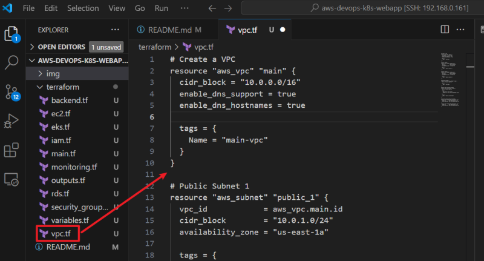

**🔁 Then in `outputs.tf`:**

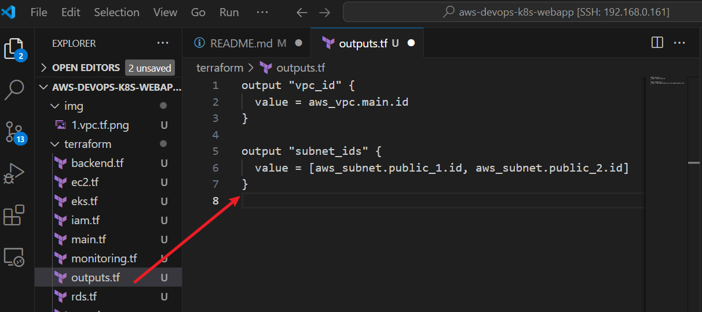

**Purpose:**

- Set up foundational network infrastructure (`VPC`, `Subnets`, `IGW`, `Route Tables`) required to launch `EC2`, `EKS`, and `RDS`
- Outputs make `IDs` reusable in other Terraform modules like `EC2`, `RDS`, etc.

### Step 2: Create a Custom `EC2 Instance` with `Packer`, Provision It with `Ansible`, and Launch via `Terraform`

**📌 Purpose:**

- Use Packer to create a custom **Amazon Machine Image (AMI)** with `Docker` and necessary tools installed.
- Use `Ansible` during the **Packer build** process to configure the instance (e.g., install `Nginx`, `dependencies`, `app packages`).
- Use Terraform to launch the EC2 instance using the custom AMI.

**📁 Directory:** `packer/ubuntu-image.json`

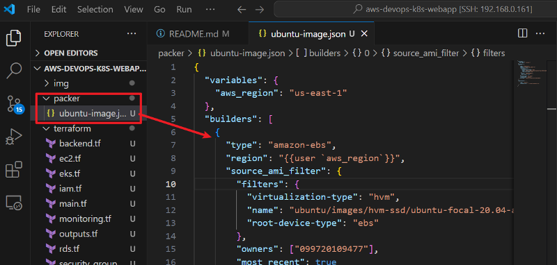

**📁 Directory:** `ansible/playbook.yml`

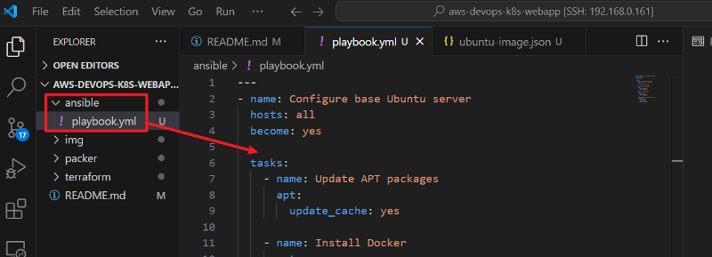

## ✅ Build the Custom AMI with Packer

**From the `packer/` directory, run:**

```bash
packer init ubuntu-image.json
packer validate ubuntu-image.json
packer build ubuntu-image.json
```
### Error

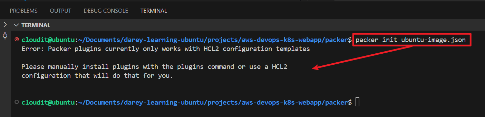

I am using a **JSON template**, but `packer init` only works with **HCL2 templates**, which use `.pkr.hcl` extensions and a different syntax.

### ✅ Quick Fix Summary

**❌ I am running:**

```bash
packer init ubuntu-image.json
```
But `.json` templates don’t support `packer init`. That command is only for `.pkr.hcl` files (HCL2 format).

**✅ What I Should Do Instead:**

If I'm using a **JSON-based Packer template** (like `ubuntu-image.json`), I don't need `packer init` at all.

**I will Run this instead:**

```bash
packer validate ubuntu-image.json
packer build ubuntu-image.json
packer build ubuntu-image.json
```
### Error

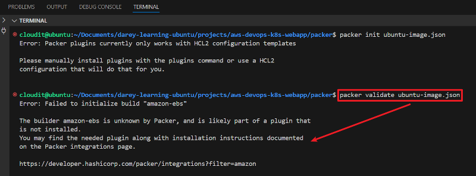

The **error** means that Packer doesn't recognize the **amazon-ebs builder** because its `plugin` is not yet installed.

This happens when you're using **Packer v1.7+** with `JSON` templates. Unlike older versions, plugins are no longer bundled by default, so you **must manually install the builder plugin** or *switch* to the **newer HCL2 format** which **installs plugins automatically** using `packer init`.

**✅ Quick Fix:**

**Convert to HCL2 Format:**

Convert your `JSON` to an **HCL2 template** (`.pkr.hcl`). HCL2 supports packer init, which will install the necessary plugins (like amazon-ebs) automatically.

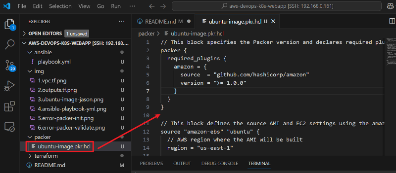

**Then I will Run the following commands from the terminal in that same folder:**

```bash
packer init ubuntu-image.pkr.hcl   # Downloads required plugins
packer validate ubuntu-image.pkr.hcl  # Checks for syntax or logical errors
packer build ubuntu-image.pkr.hcl  # Starts the AMI build process
```

### Error

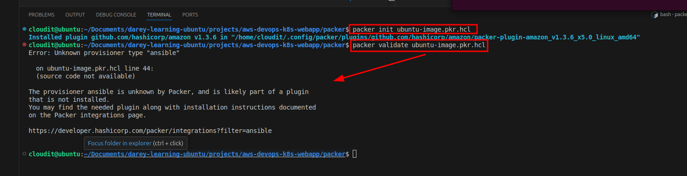

This clearly shows that Packer doesn't recognize the ansible provisioner because the Ansible plugin is not yet installed.

### ✅ Here's how I fixed it:

I need to manually install the Ansible Packer plugin, as it's not bundled by default.

**🛠 Step-by-step: Install Ansible Plugin for Packer**

1. Create the plugin directory (if not already present):

```bash
mkdir -p ~/.config/packer/plugins/github.com/hashicorp/ansible/
```

2. Download the plugin:

Go to Packer Ansible Plugin releases and download the .zip file for your architecture (linux_amd64 most likely).

Example using wget (adjust the version if needed):

```bash
wget https://github.com/hashicorp/packer-plugin-ansible/releases/download/v1.1.0/packer-plugin-ansible_v1.1.0_x5.0_linux_amd64.zip
```

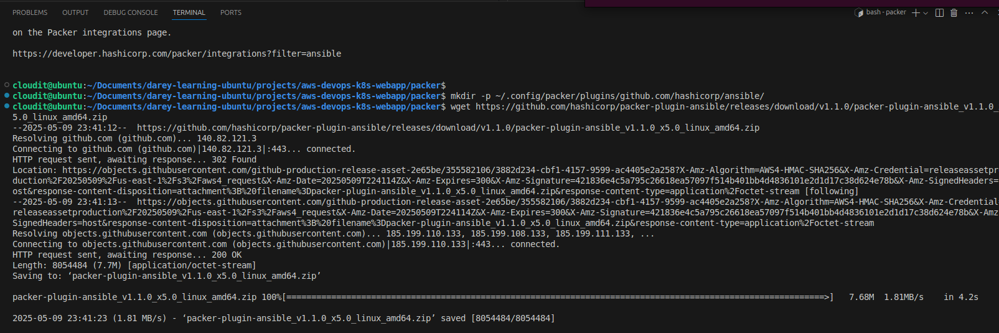

3. Unzip the plugin:

```bash
unzip packer-plugin-ansible_v1.1.0_x5.0_linux_amd64.zip
```

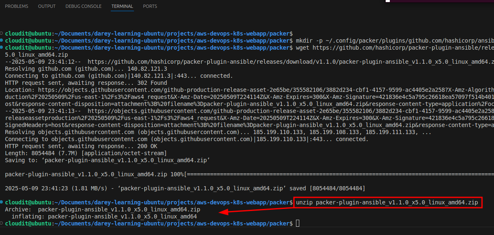

4. Move the binary to the plugins directory:

```bash
mv packer-plugin-ansible_v1.1.0_x5.0_linux_amd64 ~/.config/packer/plugins/github.com/hashicorp/ansible/packer-plugin-ansible_v1.1.0_x5.0_linux_amd64
```

5. Make it executable:

```bash
chmod +x ~/.config/packer/plugins/github.com/hashicorp/ansible/packer-plugin-ansible_v1.1.0_x5.0_linux_amd64
```

6. Try re-running:

```bash
packer init ubuntu-image.pkr.hcl
packer validate ubuntu-image.pkr.hcl
```

## Errors & Resolutions

Here’s a clear documentation of the **Packer plugin** and **AMI name issues**, along with steps taken to resolve them.

1. Unknown builder “`amazon-ebs`”

**Error:**

```
The builder amazon-ebs is unknown by Packer…
```

**Cause:**

Packer v1.7+ no longer bundles all plugins; you must install the Amazon builder plugin.

**Solution:**

Convert to HCL2 and include in your header:

```bash
packer {
  required_plugins {
    amazon = {
      source  = "github.com/hashicorp/amazon"
      version = ">= 1.0.0"
    }
  }
}
```

Then run `packer init ubuntu-image.pkr.hcl` to **auto-download** it.

1. Unknown provisioner “ansible”

**Error:**

```
Error: Unknown provisioner type "ansible"
```

**Cause:**

The Ansible provisioner plugin wasn’t installed or registered.

**Solution (auto):**

Add this to the HCL2 header and re-init:

```bash
packer {
  required_plugins {
    ansible = {
      source  = "github.com/hashicorp/ansible"
      version = ">= 1.1.0"
    }
  }
}
```
Then `packer init` downloads it automatically.

**Solution (manual):**

1. Remove any old plugin copies:
   
   ```
   rm -rf ~/.config/packer/plugins/github.com/hashicorp/ansible
   ```
2. `packer init ubuntu-image.pkr.hcl`

    Packer will install v1.1.3 (or latest) into `~/.config/packer/.../ansible/`.

3. Invalid ami_name value **AND** Call to unknown function `clean_resource_name`

**Error:**

```
AMIName should only contain alphanumeric characters…
```

```
Error: Call to unknown function

on ubuntu-image.pkr.hcl line 26:
(source code not available)

There is no function named "clean_resource_name".
```

**Cause:**

- The function `clean_resource_name` was referenced, but it is not a native function in Packer's HCL2.

- My interpolation used unsupported characters or functions.

**Solution:**

- The `clean_resource_name` function is not available in Packer's HCL2, and there is no built-in function with that name.
- To resolve this, simply omit that function and manually handle the formatting (such as using `formatdate` or ensuring that the name adheres to AWS naming conventions).
- Use a compliant HCL2 interpolation, e.g.:
- A corrected version of `ami_name` without the `clean_resource_name` function:

```
ami_name = "devops-custom-ami-${formatdate("YYYYMMDDHHmmss", timestamp())}"
```

This produces names like `devops-custom-ami-20250509123045`.

4. Final validation

After converting to `HCL2`, declaring both plugins, and fixing `ami_name`, the config **validated successfully**:

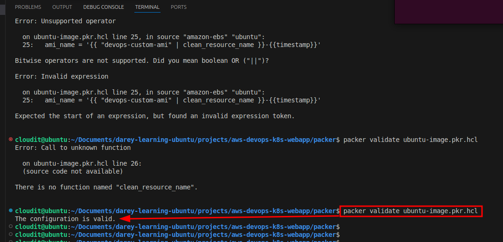

### Build the Custom AMI using Packer

Now, I will go ahead and use `Packer` to build the custom `AMI` based on the H`CL format.

**Command:**

```bash
packer build ubuntu-image.pkr.hcl
```

## Error

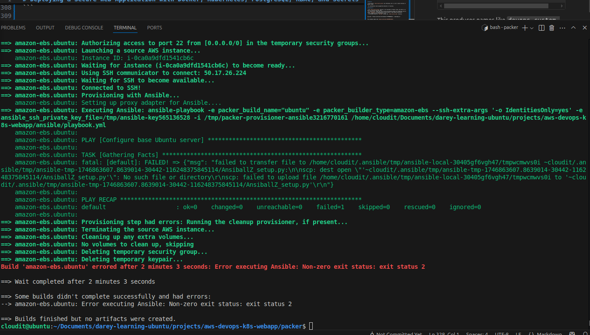

This means Ansible is trying to SSH to 127.0.0.1 (`localhost`) instead of the actual `EC2 instance IP` (e.g., 13.220.29.146). This happens when the Ansible inventory used by Packer is incorrectly pointing to localhost.


### ✅ Root Cause

Packer is launching the instance and connecting to it correctly, but when it hands over to Ansible, it creates a temporary inventory file with 127.0.0.1 as the host instead of the instance's actual IP.

This often happens because the Ansible provisioner is not configured properly to work with the SSH communicator. It's critical to let Packer manage the connection, and avoid overriding SSH settings or using incorrect extra vars like ansible_host=127.0.0.1.

### [View Packer Ansible Error Solutions](packer-ansible-Errors-Solution.md)

### 🧠 Summary of Lessons Learned

| Error             | Lesson                                                 |
| ----------------- | ------------------------------------------------------ |
| Template misuse   | Avoid `{{build.SSHPrivateKey}}`; use variables instead |
| SSH to localhost  | Ansible needs proper `ansible_user` and remote target  |
| APT fails         | Ensure `/tmp` exists with correct ownership            |
| Permissions error | Use `become: true` for elevated system tasks           |

## 🧱 Outcome

- After applying all fixes, the Packer build ran successfully:
  
  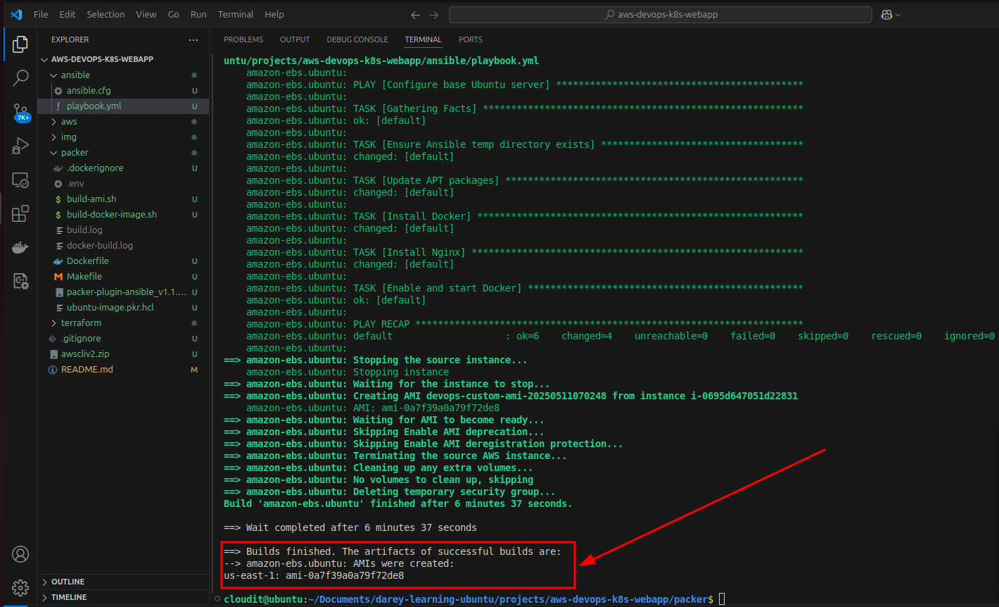

- Spun up a temporary EC2 instance using the base Ubuntu AMI

- Connected via SSH using our key pair

- Ran the Ansible playbook to install Docker, Nginx, and configure the instance
  
  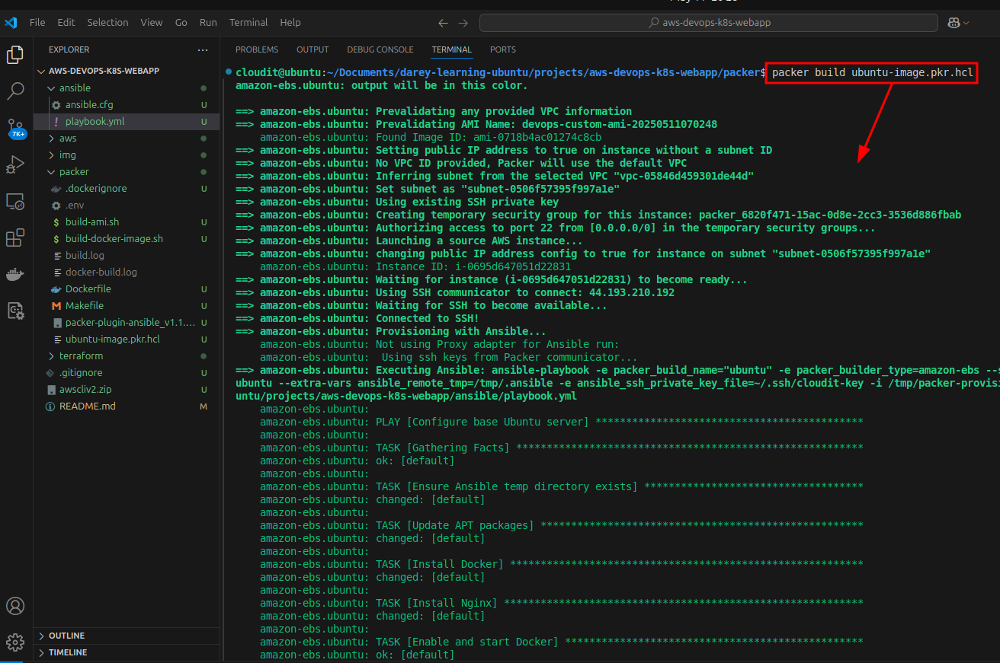

- Created a reusable AMI with all configurations baked in

  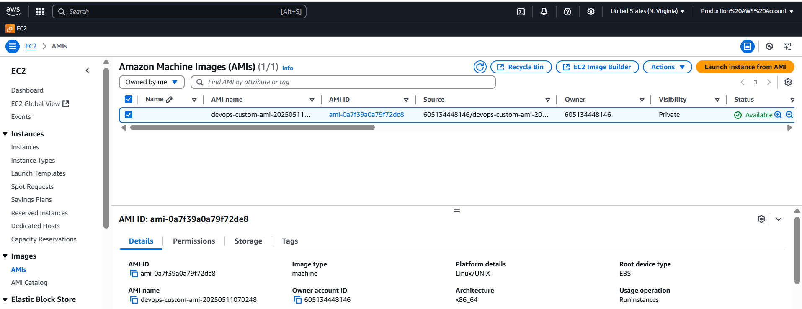

- Launched Instance from the Image

  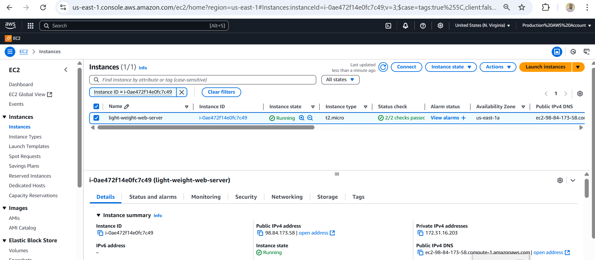

  After building the image using Packer, an EC2 instance was launched from the newly created AMI via my console. This step verifies that the image was successfully created and is bootable.\

- Connected to the Instance and Confirmed Nginx and Docker Installed by Ansible

  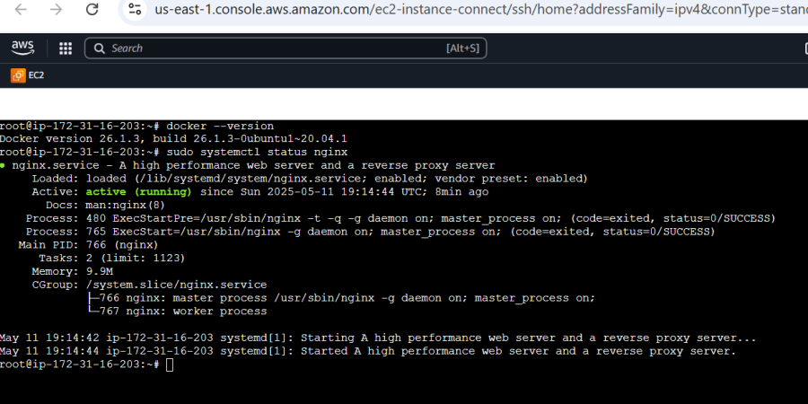

- I connected to the running instance and confirmed that:
    - **Nginx** was installed and running.
    - **Docker** was installed and its service was active.

##  Step 2.1: Provision EC2 Instance with Terraform Using the Custom AMI

**Purpose**

This step provisions an **EC2 instance** using the `AMI` we created with Packer. This instance can serve purposes like acting as a Bastion Host, hosting a service temporarily, or being part of my **EKS node group** (if needed).

### 1: Provision VPC and Networking Resources with Terraform

**Module: `terraform/modules/networking`**

### 2: Deploy EC2 Instance Using Terraform Module (Post-Packer)

**Module: `terraform/modules/ec2`**

**Root `main.tf` (wires modules together):**

**Root `terraform.tfvars` (example values):**

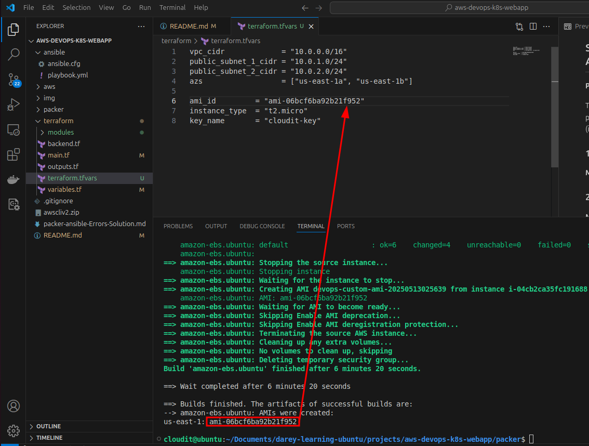

**Now I can run terraform commands from the root:**

```
terraform init
```
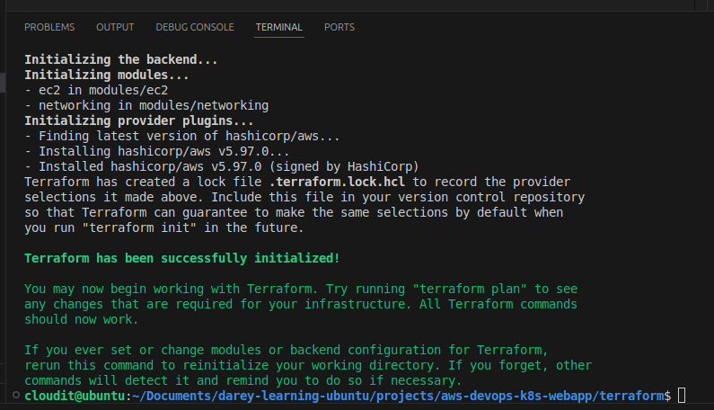

```
terraform plan
```

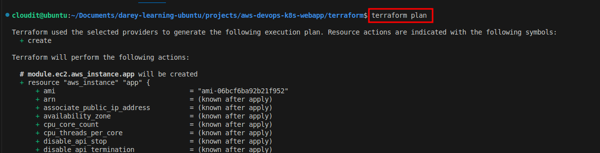

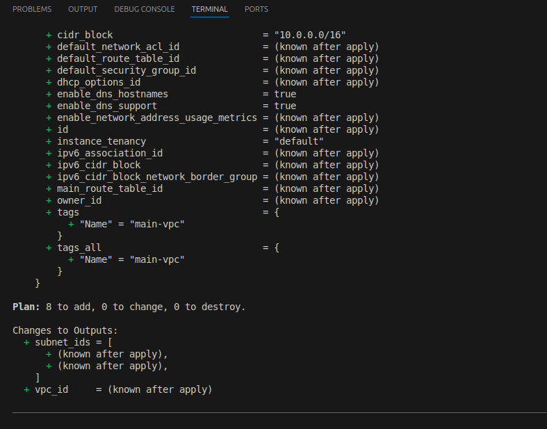


```
terraform apply
```

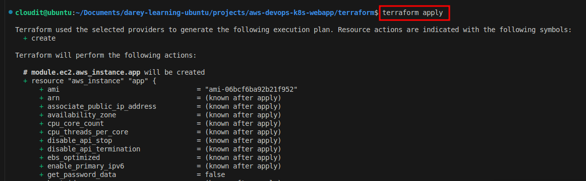

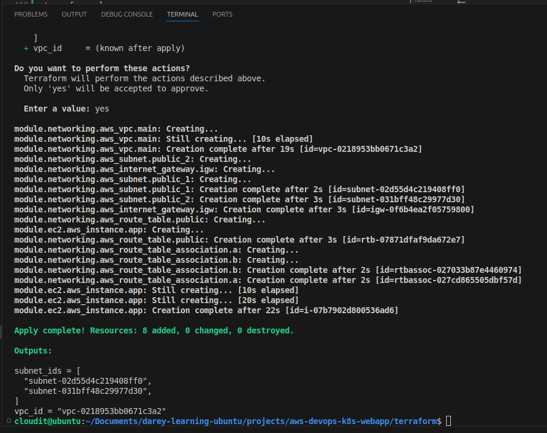


**After executing the above commands from the Terraform root directory:**

- A **Virtual Private Cloud** (`VPC`) and its `subnets` are created.
  
  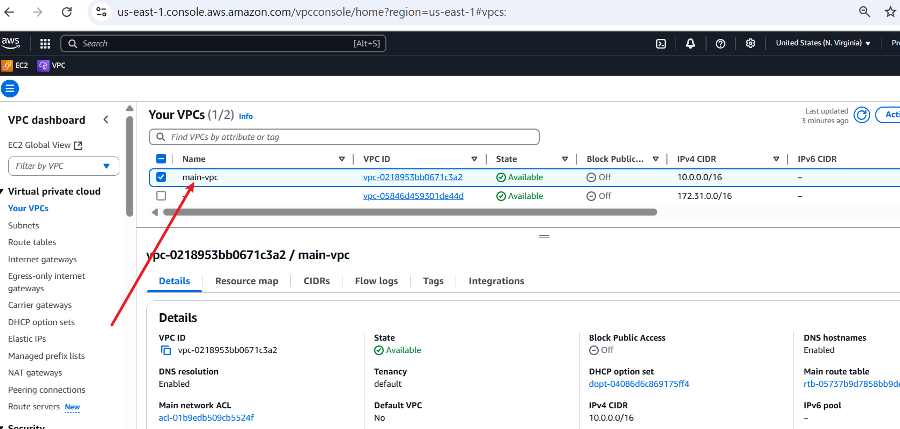

  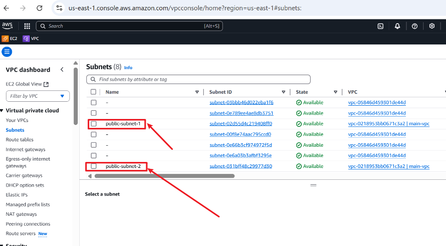

- The subnet IDs are passed into the EC2 module.

- An EC2 instance is then deployed using the AMI previously built with Packer.

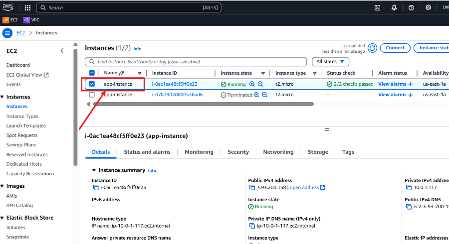

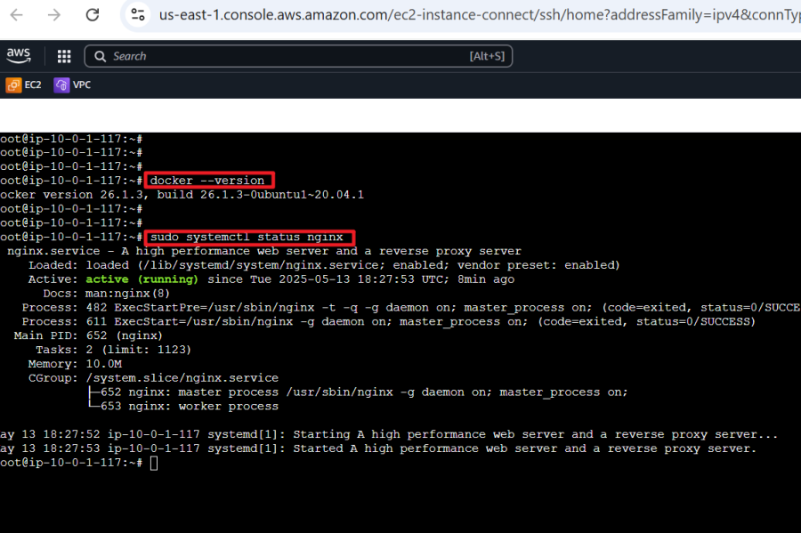


