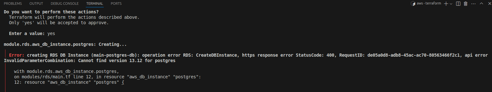
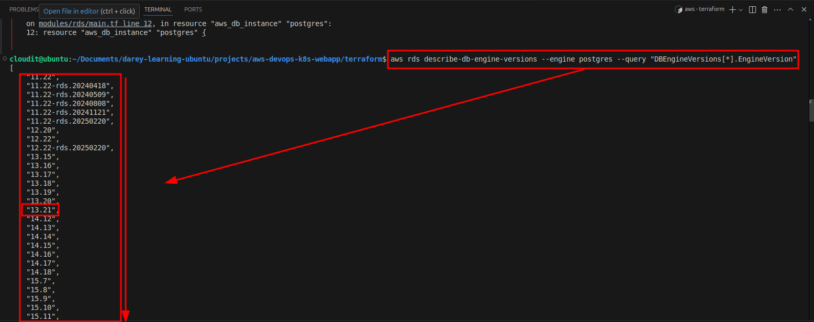
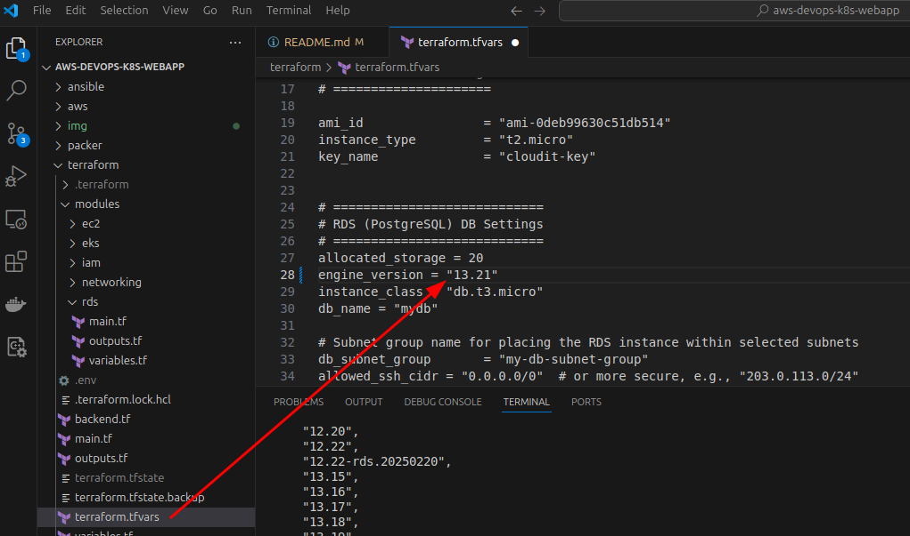
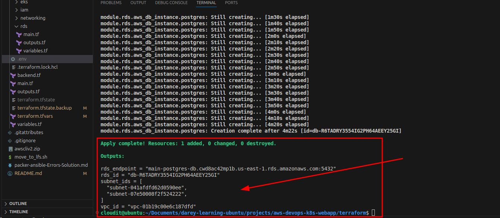
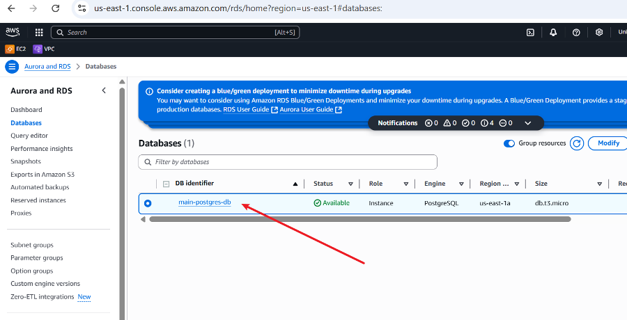
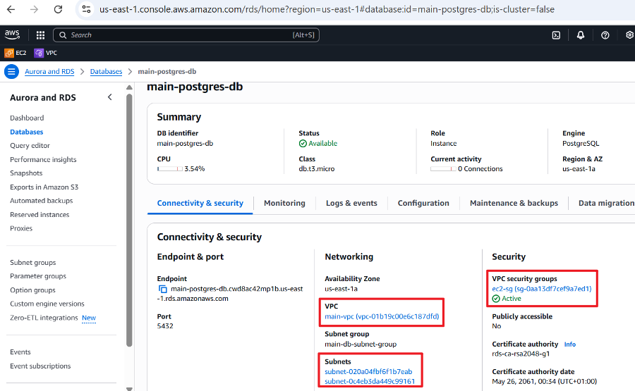
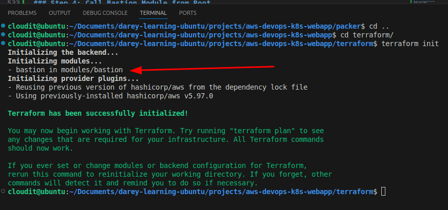
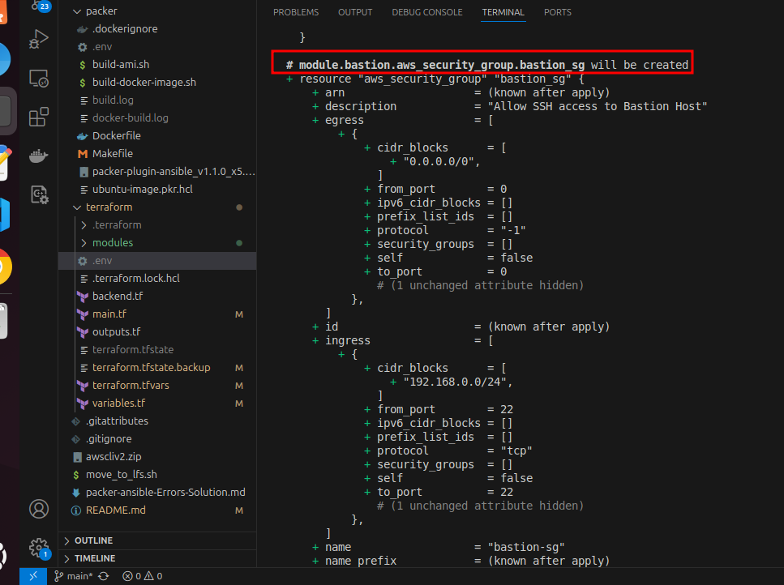
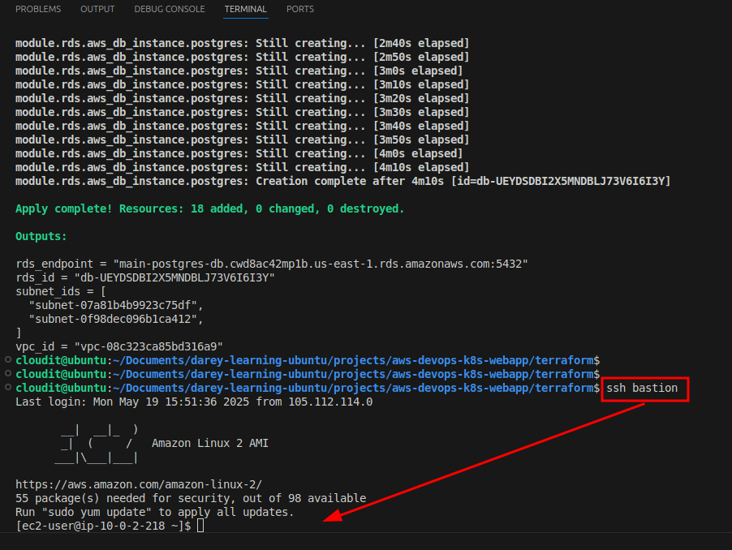
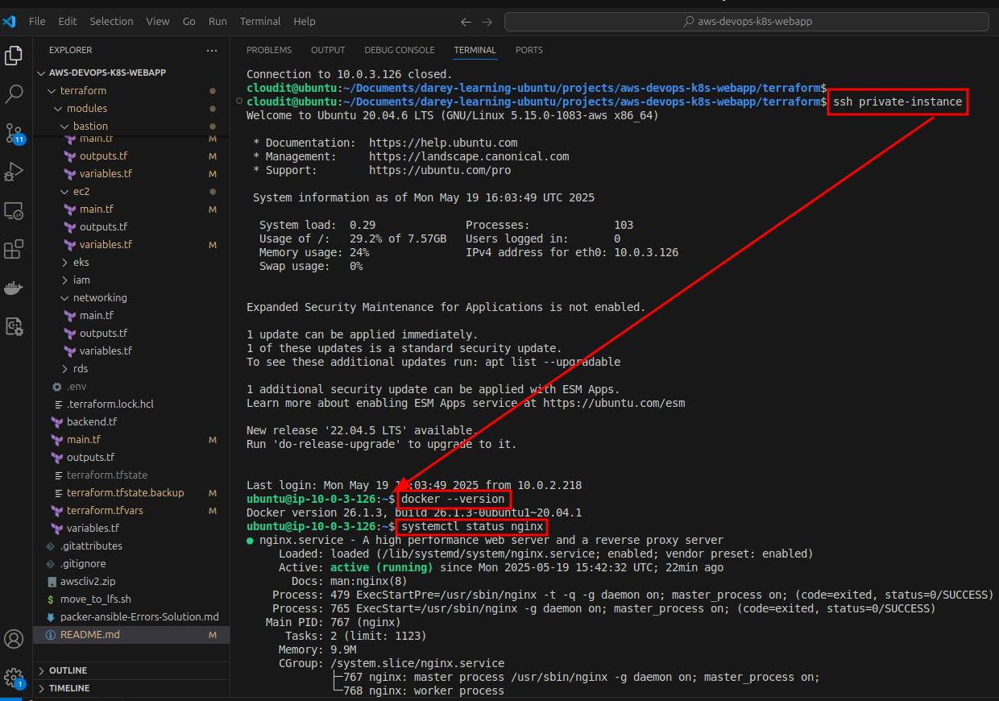

# Deploying a Secure Web Application with Docker, Kubernetes, PostgreSQL, RBAC, and Secrets Management

### 🧰 Introduction

In this project, I showcase my `DevOps` skills by deploying a **lightweight application** using various modern **DevOps tools** and best practices. This end-to-end implementation covers Infrastructure as Code (`IaC`), Configuration Management, `Containerization`, `Kubernetes` `Orchestration`, `CI/CD pipeline`, `Secrets Management`, `RBAC`, and `Monitoring`. My development environment is Visual Studio Code on a **Windows machine**, using the `Remote - SSH` extension to connect to an **Ubuntu machine** running in `VirtualBox`. I used the AWS Free Tier account for cloud provisioning.

### 🚀 Technologies Used

- **Terraform:** Infrastructure provisioning
- **Packer:** Custom AMI image creation
- **Ansible:** Configuration management and provisioning
- **Docker:** Containerizing the application
- **Kubernetes:** Orchestrating the containers
- **PostgreSQL:** Backend database
- **GitHub Actions:** CI/CD pipeline
- **AWS (EC2, RDS, CloudWatch, IAM, EKS):** Cloud resources
- **Prometheus + Grafana:** Monitoring
- **RBAC & Secrets:** Secure access control and configuration


### 📁 File Structure


## 🌐 Step-by-Step Implementation

### Step 1: Provision VPC and Networking Resources with Terraform

**File: `terraform/vpc.tf`**


**🔁 Then in `outputs.tf`:**


**Purpose:**

- Set up foundational network infrastructure (`VPC`, `Subnets`, `IGW`, `Route Tables`) required to launch `EC2`, `EKS`, and `RDS`
- Outputs make `IDs` reusable in other Terraform modules like `EC2`, `RDS`, etc.

### Step 2: Create a Custom `EC2 Instance` with `Packer`, Provision It with `Ansible`, and Launch via `Terraform`

**📌 Purpose:**

- Use Packer to create a custom **Amazon Machine Image (AMI)** with `Docker` and necessary tools installed.
- Use `Ansible` during the **Packer build** process to configure the instance (e.g., install `Nginx`, `dependencies`, `app packages`).
- Use Terraform to launch the EC2 instance using the custom AMI.

**📁 Directory:** `packer/ubuntu-image.json`


**📁 Directory:** `ansible/playbook.yml`


## ✅ Build the Custom AMI with Packer

**From the `packer/` directory, run:**

```bash
packer init ubuntu-image.json
packer validate ubuntu-image.json
packer build ubuntu-image.json
```
### Error


I am using a **JSON template**, but `packer init` only works with **HCL2 templates**, which use `.pkr.hcl` extensions and a different syntax.

### ✅ Quick Fix Summary

**❌ I am running:**

```bash
packer init ubuntu-image.json
```
But `.json` templates don’t support `packer init`. That command is only for `.pkr.hcl` files (HCL2 format).

**✅ What I Should Do Instead:**

If I'm using a **JSON-based Packer template** (like `ubuntu-image.json`), I don't need `packer init` at all.

**I will Run this instead:**

```bash
packer validate ubuntu-image.json
packer build ubuntu-image.json
packer build ubuntu-image.json
```
### Error


The **error** means that Packer doesn't recognize the **amazon-ebs builder** because its `plugin` is not yet installed.

This happens when you're using **Packer v1.7+** with `JSON` templates. Unlike older versions, plugins are no longer bundled by default, so you **must manually install the builder plugin** or *switch* to the **newer HCL2 format** which **installs plugins automatically** using `packer init`.

**✅ Quick Fix:**

**Convert to HCL2 Format:**

Convert your `JSON` to an **HCL2 template** (`.pkr.hcl`). HCL2 supports packer init, which will install the necessary plugins (like amazon-ebs) automatically.


**Then I will Run the following commands from the terminal in that same folder:**

```bash
packer init ubuntu-image.pkr.hcl   # Downloads required plugins
packer validate ubuntu-image.pkr.hcl  # Checks for syntax or logical errors
packer build ubuntu-image.pkr.hcl  # Starts the AMI build process
```

### Error


This clearly shows that Packer doesn't recognize the ansible provisioner because the Ansible plugin is not yet installed.

### ✅ Here's how I fixed it:

I need to manually install the Ansible Packer plugin, as it's not bundled by default.

**🛠 Step-by-step: Install Ansible Plugin for Packer**

1. Create the plugin directory (if not already present):

```bash
mkdir -p ~/.config/packer/plugins/github.com/hashicorp/ansible/
```

2. Download the plugin:

Go to Packer Ansible Plugin releases and download the .zip file for your architecture (linux_amd64 most likely).

Example using wget (adjust the version if needed):

```bash
wget https://github.com/hashicorp/packer-plugin-ansible/releases/download/v1.1.0/packer-plugin-ansible_v1.1.0_x5.0_linux_amd64.zip
```


3. Unzip the plugin:

```bash
unzip packer-plugin-ansible_v1.1.0_x5.0_linux_amd64.zip
```


4. Move the binary to the plugins directory:

```bash
mv packer-plugin-ansible_v1.1.0_x5.0_linux_amd64 ~/.config/packer/plugins/github.com/hashicorp/ansible/packer-plugin-ansible_v1.1.0_x5.0_linux_amd64
```

5. Make it executable:

```bash
chmod +x ~/.config/packer/plugins/github.com/hashicorp/ansible/packer-plugin-ansible_v1.1.0_x5.0_linux_amd64
```

6. Try re-running:

```bash
packer init ubuntu-image.pkr.hcl
packer validate ubuntu-image.pkr.hcl
```

## Errors & Resolutions

Here’s a clear documentation of the **Packer plugin** and **AMI name issues**, along with steps taken to resolve them.

1. Unknown builder “`amazon-ebs`”

**Error:**

```
The builder amazon-ebs is unknown by Packer…
```

**Cause:**

Packer v1.7+ no longer bundles all plugins; you must install the Amazon builder plugin.

**Solution:**

Convert to HCL2 and include in your header:

```bash
packer {
  required_plugins {
    amazon = {
      source  = "github.com/hashicorp/amazon"
      version = ">= 1.0.0"
    }
  }
}
```

Then run `packer init ubuntu-image.pkr.hcl` to **auto-download** it.

1. Unknown provisioner “ansible”

**Error:**

```
Error: Unknown provisioner type "ansible"
```

**Cause:**

The Ansible provisioner plugin wasn’t installed or registered.

**Solution (auto):**

Add this to the HCL2 header and re-init:

```bash
packer {
  required_plugins {
    ansible = {
      source  = "github.com/hashicorp/ansible"
      version = ">= 1.1.0"
    }
  }
}
```
Then `packer init` downloads it automatically.

**Solution (manual):**

1. Remove any old plugin copies:
   
   ```
   rm -rf ~/.config/packer/plugins/github.com/hashicorp/ansible
   ```
2. `packer init ubuntu-image.pkr.hcl`

    Packer will install v1.1.3 (or latest) into `~/.config/packer/.../ansible/`.

3. Invalid ami_name value **AND** Call to unknown function `clean_resource_name`

**Error:**

```
AMIName should only contain alphanumeric characters…
```

```
Error: Call to unknown function

on ubuntu-image.pkr.hcl line 26:
(source code not available)

There is no function named "clean_resource_name".
```

**Cause:**

- The function `clean_resource_name` was referenced, but it is not a native function in Packer's HCL2.

- My interpolation used unsupported characters or functions.

**Solution:**

- The `clean_resource_name` function is not available in Packer's HCL2, and there is no built-in function with that name.
- To resolve this, simply omit that function and manually handle the formatting (such as using `formatdate` or ensuring that the name adheres to AWS naming conventions).
- Use a compliant HCL2 interpolation, e.g.:
- A corrected version of `ami_name` without the `clean_resource_name` function:

```
ami_name = "devops-custom-ami-${formatdate("YYYYMMDDHHmmss", timestamp())}"
```

This produces names like `devops-custom-ami-20250509123045`.

4. Final validation

After converting to `HCL2`, declaring both plugins, and fixing `ami_name`, the config **validated successfully**:


### Build the Custom AMI using Packer

Now, I will go ahead and use `Packer` to build the custom `AMI` based on the H`CL format.

**Command:**

```bash
packer build ubuntu-image.pkr.hcl
```

## Error


This means Ansible is trying to SSH to 127.0.0.1 (`localhost`) instead of the actual `EC2 instance IP` (e.g., 13.220.29.146). This happens when the Ansible inventory used by Packer is incorrectly pointing to localhost.


### ✅ Root Cause

Packer is launching the instance and connecting to it correctly, but when it hands over to Ansible, it creates a temporary inventory file with 127.0.0.1 as the host instead of the instance's actual IP.

This often happens because the Ansible provisioner is not configured properly to work with the SSH communicator. It's critical to let Packer manage the connection, and avoid overriding SSH settings or using incorrect extra vars like ansible_host=127.0.0.1.

### [View Packer Ansible Error Solutions](packer-ansible-Errors-Solution.md)

### 🧠 Summary of Lessons Learned

| Error             | Lesson                                                 |
| ----------------- | ------------------------------------------------------ |
| Template misuse   | Avoid `{{build.SSHPrivateKey}}`; use variables instead |
| SSH to localhost  | Ansible needs proper `ansible_user` and remote target  |
| APT fails         | Ensure `/tmp` exists with correct ownership            |
| Permissions error | Use `become: true` for elevated system tasks           |

## 🧱 Outcome

- After applying all fixes, the Packer build ran successfully:
  
  

- Spun up a temporary EC2 instance using the base Ubuntu AMI

- Connected via SSH using our key pair

- Ran the Ansible playbook to install Docker, Nginx, and configure the instance
  
  

- Created a reusable AMI with all configurations baked in

  

- Launched Instance from the Image

  

  After building the image using Packer, an EC2 instance was launched from the newly created AMI via my console. This step verifies that the image was successfully created and is bootable.\

- Connected to the Instance and Confirmed Nginx and Docker Installed by Ansible

  

- I connected to the running instance and confirmed that:
    - **Nginx** was installed and running.
    - **Docker** was installed and its service was active.

##  Step 2.1: Provision EC2 Instance with Terraform Using the Custom AMI

**Purpose**

This step provisions an **EC2 instance** using the `AMI` we created with Packer. This instance can serve purposes like acting as a Bastion Host, hosting a service temporarily, or being part of my **EKS node group** (if needed).

### 1: Provision VPC and Networking Resources with Terraform

**Module: `terraform/modules/networking`**

### 2: Deploy EC2 Instance Using Terraform Module (Post-Packer)

**Module: `terraform/modules/ec2`**

**Root `main.tf` (wires modules together):**

**Root `terraform.tfvars` (example values):**


**Now I can run terraform commands from the root:**

```
terraform init
```


```
terraform plan
```


```
terraform apply
```


**After executing the above commands from the Terraform root directory:**

- A **Virtual Private Cloud** (`VPC`) and its `subnets` are created.
  
  

  

- The subnet IDs are passed into the EC2 module.

- An EC2 instance is then deployed using the AMI previously built with Packer.


### ✅ Step 3: Let’s Proceed with the `RDS Module`

**Purpose of This Step**

Provision an **Amazon RDS instance** using `Terraform` for persistent data storage. This is typically used for PostgreSQL or MySQL, and allows your application to interact with a managed relational database.

### Terraform RDS Module Structure

**Module Path:** `terraform/modules/rds/main.tf`

**Purpose:**

This file provisions a PostgreSQL RDS instance within specified subnets and security group. It uses a subnet group for isolation and places the DB in private subnets for security.

`terraform/modules/rds/variables.tf`

**Purpose:**

Defines all required variables to deploy an RDS instance, including subnet info, security group, and credentials. These variables promote flexibility and reusability.

`terraform/modules/rds/outputs.tf`

**Purpose:**

Exposes the RDS connection endpoint and instance ID to other modules or the root level (like EC2 or EKS modules that need to connect to the database).

### Root Module Usage (root main.tf addition)

## RUN TERRAFORM APPLY

### Error



The error message indicates that my Terraform code is trying to create an RDS instance with PostgreSQL version 13.12, but AWS does not support that specific version anymore.

### Solution

Find a supported PostgreSQL version:

Get All Supported Versions

Use `AWS CLI` to check which versions are supported in your region:

```bash
aws rds describe-db-engine-versions --engine postgres --query "DBEngineVersions[*].EngineVersion"
```



Based on the supported PostgreSQL versions returned by your AWS CLI command, I can now update my **Terraform configuration** to use a **valid version**.

In my root modules/terraform.tfvars, I will change:

```bash
engine_version = "13.12"
```
to a supported version like:

```bash
engine_version = "13.21" # Latest version in the 13.x series
```



### RDS CREATED








## Stage: Secure Private EC2 with a Bastion Host

### Objective

To **move the EC2 instance** to a `private subnet` and **create a Bastion Host** in the `public subnet` for secure `SSH access` using the official Amazon Linux 2 AMI.

**This approach:**

- Enhances security by removing direct internet access to the main EC2 instance.

- Implements a jump-box pattern (Bastion Host) to manage access.

## Implementation Steps

### Step 1: Move EC2 Instance to a Private Subnet

**Purpose:**

Ensure the EC2 instance is not directly exposed to the internet, limiting exposure and aligning with best security practices.

**Action:**

In my **EC2 module configuration** (`main.tf`):

```bash
# I will use a private subnet for the EC2 instance
subnet_id = subnet_id = var.private_subnet_id

# Then in modules/ec2/variables.tf
variable "private_subnet_id" {}

# Then in your root main.tf where you're calling the ec2 module: Update the module block to pass the private subnet ID:

module "ec2" {
  source             = "./modules/ec2"
  private_subnet_id  = module.networking.private_subnet_ids[0]
  # ...other variables
}


# Allow SSH only from Bastion subnet (e.g., 10.0.1.0/24)
allowed_ssh_cidr = "10.0.1.0/24"
```

### Step 2: Create the Bastion Host in the Public Subnet

**Purpose:**

Provide a secure and auditable access point (jump box) to the private EC2 instance.

📁 File: modules/bastion/main.tf

### Step 3: Define Bastion Module Variables
📁 File: modules/bastion/variables.tf

📁 File: modules/bastion/outputs.tf

### Step 4: Call Bastion Module from Root
📁 File: `main.tf` (root)

### Step 5: Add Root-Level Variables for Bastion

📁 File: `variables.tf` (root)

📁 File: `terraform.tfvars`





| Item                     | Status       |
| ------------------------ | ------------ |
| EC2 in private subnet    | ✅ Configured |
| Bastion in public subnet | ✅ Configured |
| SSH SG rules updated     | ✅ Restricted |
| Key pair working         | ✅ Verified   |


## Updated EC2 Module Configuration (`modules/ec2`)

Previously, SSH access to the EC2 instance was configured using a hardcoded CIDR block (e.g., `10.0.1.0/24`) in the EC2 instance’s security group. This was not ideal for maintainability or security. The new approach replaces the hardcoded CIDR block with a reference to the Bastion Host's Security Group, allowing SSH only from the Bastion.


## What Was Updated and Why

1. `main.tf` in `modules/ec2/`

**What Changed:**

- The `aws_security_group` no longer contains an inline ingress rule for SSH.

- A dedicated `aws_security_group_rule` **resource** (`allow_ssh_from_bastion`) was added to manage SSH access more explicitly.

- `source_security_group_id` references the Bastion Host's security group, which allows fine-grained access control.

**Why:**

- Improves modularity and clarity.

- Avoids hardcoding CIDR blocks.

- Enables SSH access only from a trusted Bastion Host.

2. variables.tf in modules/ec2/

**What Changed:**

- Added a new input variable: `bastion_sg_id`.

**Why:**

- This allows the EC2 module to dynamically accept the Bastion Host's security group ID and use it in the `aws_security_group_rule`.

3. `outputs.tf` in `modules/bastion/`

**What Changed:**

- Introduced an output named bastion_sg_id to expose the Bastion Host’s security group ID.

**Why:**

- So the root module can retrieve and pass this value into the EC2 module.

4. Root Module Call to module.ec2

**What Changed:**

- Added `bastion_sg_id` = `module.bastion.bastion_sg_id` to the EC2 module call block.

**Why:**

- Connects the Bastion output to the EC2 input, completing the flow of access control.

### Impact

- SSH to the EC2 instance is now securely locked down to only traffic coming from the Bastion Host.

- Future changes to the Bastion Host SG will automatically apply to EC2 access as well.

- All configuration is now reusable, traceable, and easier to maintain


## SSH Access via Bastion Host

### Step 1: SSH into the Bastion Host




### Step 2: SSH into Private EC2 Instance via Bastion Host

- Add a ProxyJump Config

  - Edit SSH config file:

  ```bash
  nano ~/.ssh/config
  ```

Add:

```bash
Host bastion
  HostName <bastion_public_ip>
  User ec2-user
  IdentityFile ~/.ssh/cloudit-key

Host private-instance
  HostName <private_instance_private_ip>
  User ubuntu
  IdentityFile ~/.ssh/cloudit-key
  ProxyJump bastion
```

I can just `SSH` into the **private instance or bastion-host** from my local terminal like this:

```bash
ssh bastion
```


```bash
ssh private-instance
```



After implementing **SSH access through a Bastion Host**, I successfully configured SSH to connect to both the Bastion Host and the Private EC2 Instance directly from my **local machine** using the `ProxyJump` option in the **SSH configuration file**.

By adding the appropriate `ProxyJump config`, I was able to streamline the connection process, enabling secure and seamless SSH access to the private instance without manually hopping through the Bastion Host each time.

From the attached screenshot, you’ll notice that `Docker` and `Nginx` were already installed on the **private EC2 instance**. These were **provisioned** automatically using `Packer` in combination with `Ansible`, demonstrating the success of our preconfigured image build process.


